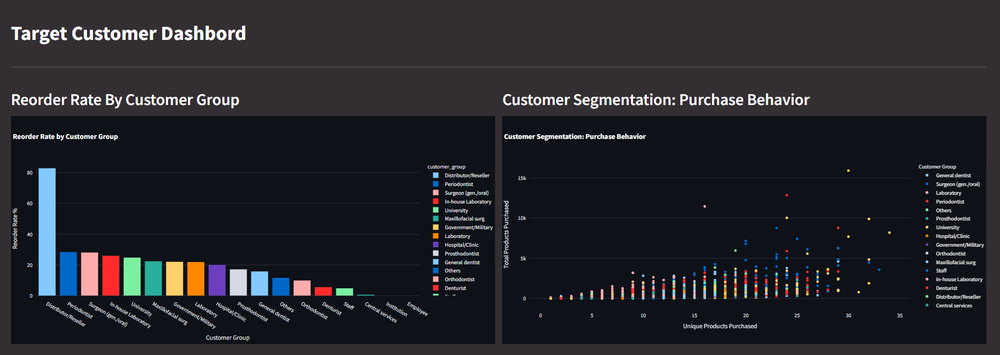
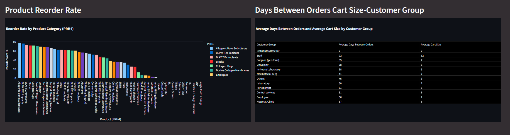
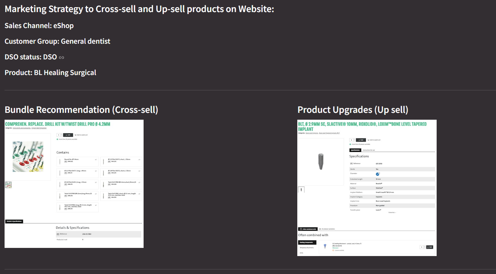
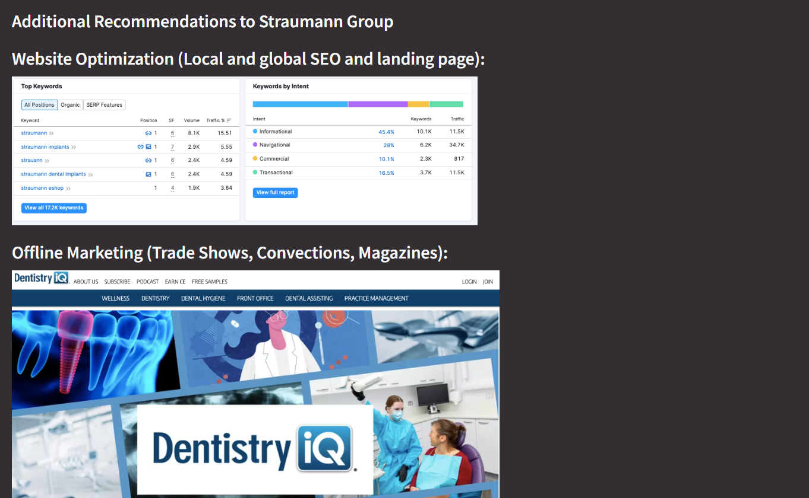
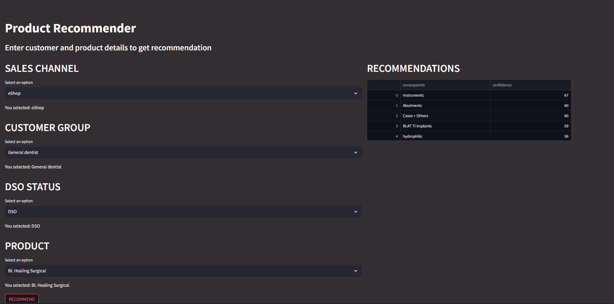

# Market Basket Analysis for Product Bundling and Customer Behavior 
## **Introduction**
The project focusing on analyze customer buying patterns and product bundling through **Market Basket** and **unsupervised machine learning models(Apriori Algorithm)**, demonstrated thorough analysis and unique metrics, addressing feedback to improve our predictive models and dashboards. Our feature engineering process transforms raw data into actionable insights, while our dashboards and market basket analysis provide valuable tools for product recommendations and sales strategies. 

For App development, I created the html by **streamlit**.

## **Feature Engineering**
Feature engineering entails converting raw data into features that are appropriate for machine learning models to comprehend and utilize efficiently. The aim is to improve the performance of machine learning algorithms and integrate them into dashboard development by offering meaningful and pertinent input variables.

In this project, I have developed two tables ***the user_feature_table and order_feature_table*** to extract valuable insights and features.

- ***user_feature_table:***
This table is generated to capture various characteristics of each customer.

| Feature | Description |
|----------|----------|
| user_reorder_rate   | Average reorder rate on orders placed.|
| user_unique_products| Distinct product ordered.  |
| user_total_products | Total products ordered. |
| user_avg_cart_size | Mean products per order = average cart size. |
| user_avg_days_between_order | Average days between previous orders. |
| user_reordered_products_ratio | user product reorder ratio.​ |

- ***order_feature_table:***
This table is created to analyze features related to each order, including the PRH1 and PRH4 product categories, sales channel, PRH4 reorder rate, mean order material net value, PRH1 reorder rate, and sales channel reorder rate.

| Feature | Description |
|----------|----------|
| PRH4_reorder_rate   | Whether the PRH4 will be reordered in the next order.​   |
| mean_order_material_net_value   | Average order material net value in each order.​ |
| PRH1_reorder_rate | Whether the PRH1 will be reordered in the next order.​|
| sales_channel_reorder_rate | Whether the sales channel will be used in the next reorder.​|

## **Target Customer Dashboard**

