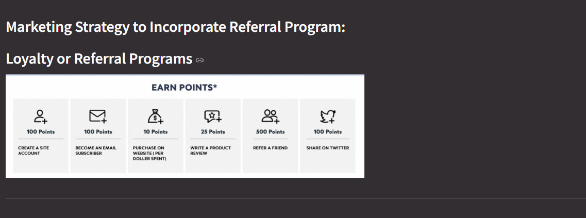

# Market Basket Analysis for Product Bundling and Customer Behavior 
## **Introduction**
The project focusing on analyze customer buying patterns and product bundling through **Market Basket** and **unsupervised machine learning models(Apriori Algorithm)**, demonstrated thorough analysis and unique metrics, addressing feedback to improve our predictive models and dashboards. Our feature engineering process transforms raw data into actionable insights, while our dashboards and market basket analysis provide valuable tools for product recommendations and sales strategies. 

For App development, I created the html by **streamlit**.

## **Feature Engineering**

